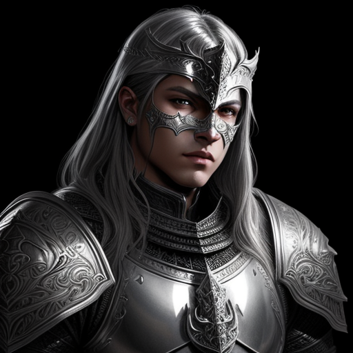
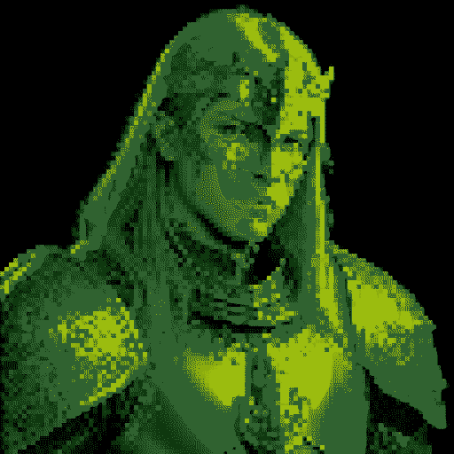
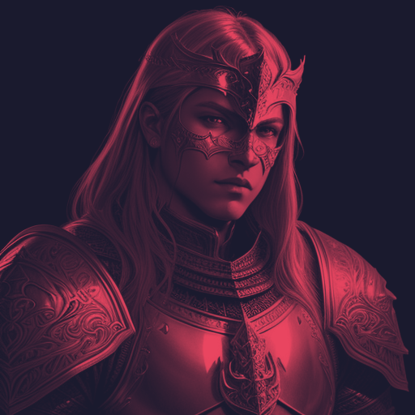

# Dyson Crucible

**A local, free AI art studio that draws in your style, for the game dev who is not an artist.**

You do not draw. You describe, rate, and pick. It runs entirely on your own Windows PC with no accounts, no subscriptions, and nothing sent to the cloud. A local ComfyUI server does the image generation and a local Ollama model is the "brain" that turns your plain-language notes into better prompts. It learns your look from a handful of reference images, so every hero it makes looks like it belongs in your game.

<p align="center">
  
  
  
</p>
<p align="center"><em>One prompt, generated locally on a home GPU, then restyled with the built-in look lab (raw, GameBoy pixel-art, duotone). All made in the app.</em></p>

---

## What you can do

Drop in a few images that share the look you want, then direct art the way you would direct a tireless artist: say what you want, watch it draw options in your style, tell it what to change, and pick the winner. When you are happy, one click turns that winner into a transparent sprite, a pixel-art tile, an upscaled PNG, or a clean SVG. Everything you make persists to disk, so you always reopen right where you left off.

---

## Features

### 🎯 Three ways to start
A funnel that meets you wherever you are:
- **New Hero** - you already know the style and the character. Name it, generate, refine.
- **Surprise Me** - you have a vague phrase and want ideas. It fans out a mood board of wildly different takes to cherry-pick and combine.
- **Find a Style** - you have no idea yet. Rate a wide spread of images 1 to 5 stars over a few rounds; it steers toward your taste until a look emerges, which you save as a Style you can reuse.

### 🌳 Categories with inherited style DNA
Nestable style groups. Every asset inside a category inherits its "style DNA" (its reference set plus style words), so a whole set of heroes stays cohesive without you re-specifying the look each time.

### 🖼️ Style matching from your own art
Your reference images do double duty: they steer generation (via IP-Adapter) so output looks like your art, and they rank the results (via CLIP) so the candidates closest to your taste float to the top. Your eye still makes the final call.

### 💬 Chat as your control surface
Refine by talking: "more armor, less blue" and it redraws with your notes baked in. A global control-panel chat can also run commands and answer how-to questions. The brain is a local Ollama model (default `qwen2.5:3b-instruct`); if you prefer, it can use a free Gemini API key or the `claude` CLI instead. It only ever edits prompts, never your images.

### 🧬 Multi-image blend
Blend the style of some images with the character from another, plus a text prompt, to fuse influences into one result.

### 🎨 Post-processing look lab
26 composable steps with live previews: trim, background-remove, upscale, dither, pixelate, palette-map to GameBoy / PICO-8 / NES, toon, duotone, halftone, scanlines, grain, chromatic aberration, glow, vignette, normal-map (for 2.5D lighting), vectorize, and more. Chain them yourself or use one-click presets like `game_sprite`, `gameboy`, `comic`, and `retro_crt`. Vectorize is just one optional step, not something forced on every image.

### 📦 LoRA / ControlNet manager
Search and download models from Civitai and apply LoRAs to a specific hero.

### 🛡️ Resilience, and your machine stays yours
- A **self-healing generation queue** that retries failed jobs, relaunches ComfyUI if it crashes, and requeues orphaned work after a power loss, all persisted to disk.
- A **Reclaim machine** kill switch: one click pauses the queue, stops generation, and frees the GPU so you can have your computer back.
- A **live resource readout** (CPU / RAM / GPU / VRAM) so the machine is never a black box.

### 🩺 A friendly Doctor
Checks your setup every time the dashboard loads and tells you, with one-click Start buttons, exactly what is missing (ComfyUI down, Ollama unreachable, a model file absent).

### ⌨️ Built for flow
Command palette (Ctrl+K), hotkeys, a guided tutorial for first-timers, and a light/dark theme.

---

## Quick start

The easy path is one script.

1. **Clone the repo.**
2. **Run the bootstrap installer:**
   ```powershell
   .\bootstrap.ps1
   ```
   It auto-installs the Python deps, Ollama plus the brain model, ComfyUI plus the IP-Adapter node, the model files, and wires the config for you. It is idempotent (safe to re-run; it skips whatever is already there) and prints clear step-by-step progress. Anything it cannot install automatically, it tells you the one link to click. Full details in [docs/SETUP.md](docs/SETUP.md).
3. **Add your style images.** Drop 8 to 20 images that share one clear look into `references/default/`. A consistent set of ten beats a messy set of thirty.
4. **Start it up.** Launch ComfyUI and `ollama serve` (the Doctor has Start buttons for both), then run the dashboard and open it:
   ```powershell
   python conductor/server.py
   ```
   Then open http://127.0.0.1:7860

**Prefer to do it by hand?** You can skip the bootstrap and install the three pieces yourself: Python 3.10+, ComfyUI (with an SD1.5 checkpoint and the `ComfyUI_IPAdapter_plus` custom node), and Ollama. Then run `python conductor/server.py`. See [docs/SETUP.md](docs/SETUP.md) for the manual walkthrough.

---

## A day in the life

> You type **a menacing frost knight**. It draws **4 options in your style** and quietly ranks them against your reference art. None quite right? You say **more armor, less blue** and it redraws. You pick your favorite, then click once to get a transparent PNG, a pixel-art sprite, or a clean SVG, ready to drop straight into your game.

That is the whole loop. It feels like texting an artist who never gets tired.

---

## Requirements

- **Windows** with an **NVIDIA GPU.** It works on a 4GB card thanks to built-in low-VRAM handling; just keep image size at 512.
- **About 15GB of disk** for the model files.
- Everything runs **locally and free.** The only optional paid things are a beefier GPU or a paid "brain" (a Gemini key or Claude); the defaults cost nothing.

This is a local tool you run on your own machine, not a hosted website. Nothing is uploaded, nothing is billed.

---

## How it is built

Plain stdlib Python backend plus framework-free ES modules on the front end, deliberately modular so a broken feature can never take down the app. If you want to understand or extend it, start with [docs/ARCHITECTURE.md](docs/ARCHITECTURE.md) for the tour and [docs/EXTENDING.md](docs/EXTENDING.md) for the step-by-step recipes.

---

*Made for one game dev who could not draw, and now does not have to. If that is you too, welcome.*
