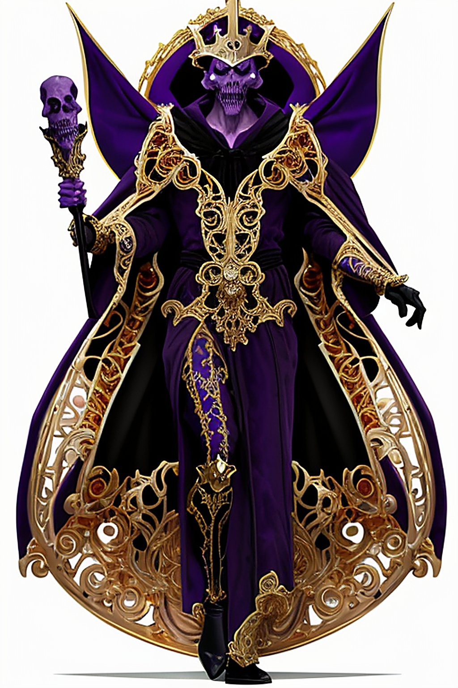
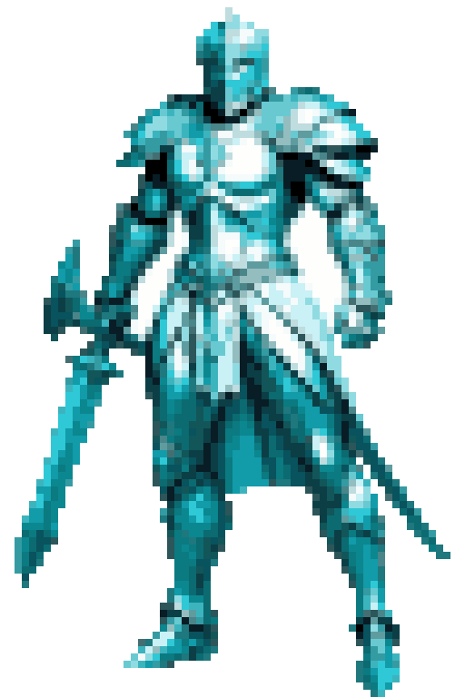
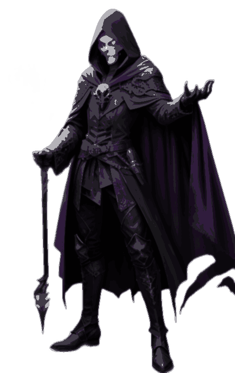

# Dyson Crucible

**A local, free AI art studio that draws in your style, for the game dev who is not an artist.**

You describe, rate, and pick. It runs entirely on your own Windows PC, no accounts, no subscriptions, nothing sent to the cloud. Local ComfyUI does the drawing, a local LLM is the "brain" that turns your notes into better prompts, and it learns your look from a few reference images.

<p align="center">
  
  
  
</p>
<p align="center"><em>One prompt, generated locally on a home GPU, then restyled in the built-in look lab: the original render, elegant color pixel art, and clean reduced-color vector art (flat spot colors, screen-print ready). All made in the app.</em></p>

---

## Features

- **Three ways to start.** *New Hero* (you know what you want), *Surprise Me* (a vague phrase becomes a mood board of wildly different takes to cherry-pick), *Find a Style* (no idea yet, rate images 1 to 5 stars and it steers toward your taste, then saves the look).
- **Style matching.** Your reference images steer generation (IP-Adapter) and rank the results (CLIP), so output looks like your art and the best rise to the top.
- **Chat control.** "More armor, less blue" and it redraws. A control-panel chat runs commands and answers how-to questions. Brain defaults to a local Ollama model; a free Gemini key or the `claude` CLI work too.
- **Categories** that pass a shared look down to every hero inside them.
- **Multi-image blend** (style from these, character from that, plus a prompt) and **LoRA/ControlNet** download from Civitai.
- **A 26-step look lab** with live previews: transparent sprite, upscale, dither, pixel-art, palette-map (GameBoy/PICO-8/NES), toon, duotone, halftone, scanlines, grain, glow, normal-map for 2.5D lighting, vectorize, and more. Chain them or use one-click presets. Vectorize is optional, never forced.
- **Your machine stays yours.** Self-healing queue (retries, relaunches ComfyUI, recovers after a crash), a **Reclaim machine** kill switch (pause + stop + free the GPU), and a live CPU/RAM/GPU/VRAM readout.
- **A friendly Doctor** that checks your setup on load and, with one-click Start buttons, tells you exactly what is missing. Plus a command palette (Ctrl+K), hotkeys, a tutorial, and light/dark themes.

---

## Quick start

```powershell
git clone https://github.com/FreelanceWillie/dyson-crucible
cd dyson-crucible
.\bootstrap.ps1            # installs Python deps, Ollama + model, ComfyUI + node, model files, config
```
Then drop 8 to 20 style images into `references/default/`, start ComfyUI + `ollama serve` (the Doctor has Start buttons), and run:
```powershell
python conductor/server.py     # open http://127.0.0.1:7860
```
`bootstrap.ps1` is idempotent and prints clear progress; anything it cannot auto-install, it links. Details and a manual-install path: [docs/SETUP.md](docs/SETUP.md).

---

## How it feels

> Type **a cute but evil little warlock**. It draws 4 in your style and ranks them against your art. Say **more sinister, glowing eyes** and it redraws. Pick your favorite, then one click to a transparent PNG, a pixel sprite, or a clean SVG, ready for your game.

## Requirements

Windows + an NVIDIA GPU (works on 4GB with built-in low-VRAM handling; keep size at 512), about 15GB disk for models. Runs locally and free; a local tool you run, not a hosted site.

Built on stdlib Python + framework-free ES modules, deliberately modular. To understand or extend it: [docs/ARCHITECTURE.md](docs/ARCHITECTURE.md) and [docs/EXTENDING.md](docs/EXTENDING.md).
